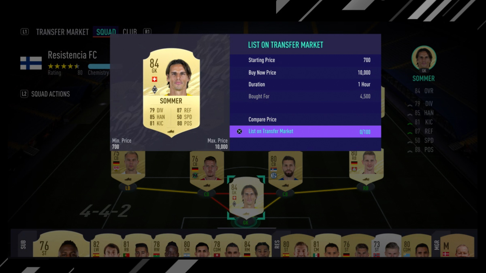
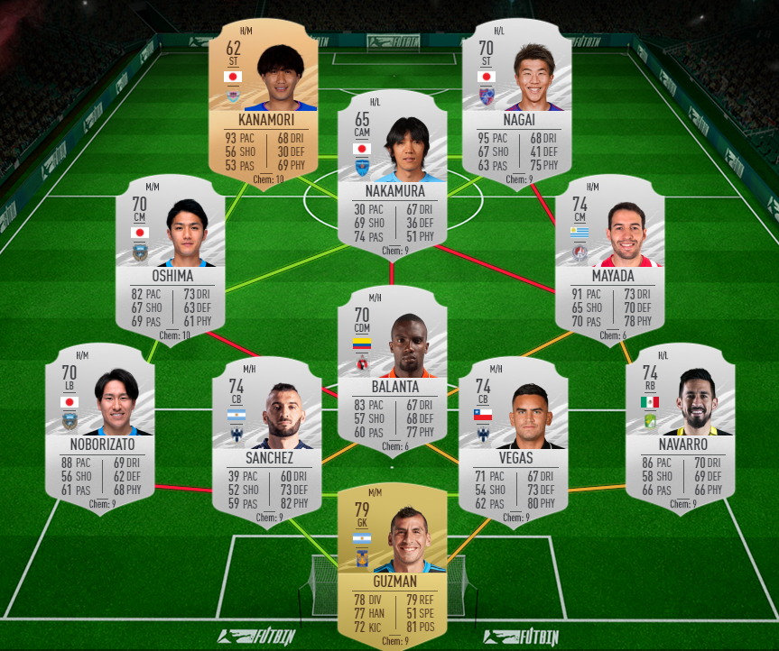
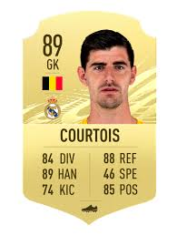
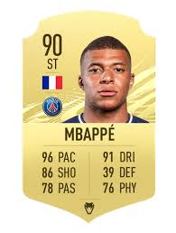

```{r setup, include=FALSE}
knitr::opts_chunk$set(echo = TRUE)
library(plotly)
library(ggplot2)
library(gridExtra)
load("workdata.RData")
```
# Background

Fifa 21 is a video game based on professional soccer players. Fifa 21 has a few game modes, with ultimate team being the one played the most. The goal of ultimate team is to create the best possible team of players and to play against other gamers online. In order to obtain players, gamers can purchase packs, which gives random players, or gamers can bid or buy players directly from the market with coins which are acquired by playing matches against other online players or by purchasing them. Ground players and goalkeepers are graded by Muller-Mohring who gives each player's skills and attributes a whole number from 1 to 99 based on their performance in club and international soccer games. The market allows gamers to trade players for coins, and a key question to gamers is "How much should I spend on players in the market, and on what basis can I compare them?". In this project, we wish to find the correlated factors that drive prices for goalkeepers, defenders, midfielders, and attackers in the market.

```{r, echo=FALSE, fig.align='center'}

```

Gamer placing a 84 overall rated goalkeeper on the marketplace up for bid starting at 700 coins, as well as a buy now price, which was listed for 10,000 coins. The selling price was 4,500 coins.

We can divide all players into two categories - goalkeepers and ground players (defenders, midfielders, and attackers). The six attributes goalkeepers are graded on include diving, handling, kicking, reflexes, positioning, and speed.The six attributes ground players are graded on include dribbling, shooting, passing, dribbling, pace, and physicality. The purpose of this project is to answer the question "What factors are most important in predicting the price certain players will sell for on the ultimate team market?". We hypothesize that goalkeepers' prices will be largely correlated with the reflexes and diving, defenders' prices will be reflected by physicality and defending, midfielders' prices will be strongly correlated with passing, and attackers' prices will be rely on shooting. The machine learning model will then be run to find what factors gamers consider the most when purchasing ground players and goalkeepers.

Some people considered projects similar to this one, but they either used a smaller dataset with "big name" players or only focused on one position. In this project, we wish to find a model that accurately reflects the factors that gamers consider when purchasing these players. Our dataset was obtained from Kaggle, including 17314 different cards with all their attributes and individual traits, including 95 columns of data with over 30 quantitative variables we are interested in assessing.

We were inspired to create a project about this topic because we have been shocked by the prices that players go for on the market when the new games get released. This dataset focused on the data from the release of the ultimate team game mode to when the the next Fifa was released. It includes the maximum, minimum, and last price of transactions for players in the marketplace across different consoles. We will be focusing primarily on the last price on the PS4 console.


```{r, echo=FALSE, fig.align='center'}

```

The photo above displays the gold goalkeeper, the silver defenders and midfielders, and a bronze striker and a silver striker.

```{r, echo=FALSE, fig.align='center'}

```
Courtois is one of the most highest rated goalkeepers in the game. Notice that his 6 graded attributes are diving, handling, kicking, reflexes, speed, and goalie positioning, which will differ from the ground players. We believe that goalies' prices will be most correlated with diving (84) and reflexes (88).

```{r, echo=FALSE, fig.align='center'}

```

Frenchman Killian Mbappe plays the striker position for PSG. Since strikers are attackers and thus ground players, their attributes are pace, shooting, passing, dribbling, defending, and physicality. We predict the most important factor for strikers is shooting (86).

# Data-Driven Question

What factors are most important in predicting the price certain players will sell for on the ultimate team market?

# Exploratory Data Analysis

```{r include = FALSE}
naPercentage <- function(col_name){
  return(sum(is.na(players_read[,col_name]))/nrow(players_read))
}
nas <- c("xbox_min", "xbox_last", "xbox_max", "ps4_min","ps4_last", "ps4_max", "pc_min","pc_last", "pc_max")
price_nas <- data.frame(nas = nas, console = rep(c("xbox","ps4", "pc"), each=3), type = rep(c("min", "last", "max"), times=3))
price_nas[,1] <- sapply(price_nas[,1],naPercentage)
target_nas <- plot_ly(price_nas, x = ~console, y=~nas, color = ~type,type="bar")
target_nas <- target_nas %>% layout(yaxis = list(title = 'Percentage'), title = "Percentage Nulls per Console", barmode = 'group')


players_price_points <- plot_ly(data = players, x = ~overall, y = ~ps4_last, trace="scatter")
```
This dataset had many possible variables that represented player's price. The first thing we did was to analyze which one of them was the most appropriate to be our target variable.

```{r echo = FALSE}
target_nas
```
As you can see in the bar plot, ps4 is the only viable choice. Since the ps4 max is the buy now price and ps4 min is the minimum first bid, they are not exactly appropriate for our investigation. Ps4_last is what players went for in the market, so we chose that
```{r echo = FALSE, message=FALSE, warning=FALSE}
players_price_points
```
Next, we observed our distribution was pretty exponential. This made sense to us, since almost no one uses the worst players. In order to mitigate that, we decided to take a look at how the Icons team 
```{r echo = FALSE}
league_stats
```
We compared leagues and plotted averages for the four most expensive leagues in fifa. Observe how icons is superior in almost everything, and absolutely dwarfs every other league's normalized average price

# Method

Initially we used a random forest algorithm to predict players' prices in FUT marketplace. 
After observing the density plot, we came to the conclusion that our result could be skewed due to outliers.

```{r echo = FALSE}
grid.arrange(keeper_elbow,defender_elbow,midfielder_elbow,attacker_elbow)
```
After using kmeans to cluster our data in terms of price, it did seem to be the case that there were two very distinct groups in each position
```{r echo = FALSE, message=FALSE, warning=FALSE}
cluster_vis <- function(df, t){ 
  return(
    plot_ly(data = df, x = ~overall, y = ~ps4_last, color=~clusterNum) %>% 
      layout(showlegend = FALSE, 
annotations = list(
 list(x = 0.4 , y = 0.9, text = t, showarrow = F, xref='paper', yref='paper')
 )))
}
keeper_cluster$clusterNum <- as.character(keeper_cluster$clusterNum)
defender_cluster$clusterNum <- as.character(defender_cluster$clusterNum)
midfielder_cluster$clusterNum <- as.character(midfielder_cluster$clusterNum)
attacker_cluster$clusterNum <- as.character(attacker_cluster$clusterNum)

subplot(cluster_vis(keeper_cluster, "Goalkeepers"),
        cluster_vis(defender_cluster, "Defenders"),
        cluster_vis(midfielder_cluster, "Midfielders"),
        cluster_vis(attacker_cluster, "Attackers"), nrows=2) %>% 
  layout(title = "Players with Outlying Prices by Position")

```
After running the algorithm, our suspicions were proved right

## Price Outliers by Position {.tabset}

### Keeper Price Outlier
```{r echo=FALSE}
attackers_outliers <- attackers_outliers%>%mutate(clusterNum=3-clusterNum)
plot_ly(keeper_outliers, labels = ~clusterNum, values = ~count, type = 'pie')
```
### Defender Price Outliers
```{r echo=FALSE}
plot_ly(defenders_outliers, labels = ~clusterNum, values = ~count, type = 'pie')
```
### Midfielder Price Outliers
```{r echo=FALSE}
plot_ly(midfielders_outliers, labels = ~clusterNum, values = ~count, type = 'pie')
```
### Attacker Price Outliers
```{r echo=FALSE}
plot_ly(attackers_outliers, labels = ~clusterNum, values = ~count, type = 'pie')
```
## {-}

So we removed the outliers from and run random forests on it again.

# Results

```{r echo = FALSE}
results <- data.frame(model=c("before","after"), keeper = c(b_keepers_rmse, keepers_rmse), defender = c(b_defenders_rmse,defenders_rmse),
                      midfielders = c(b_midfielders_rmse, midfielders_rmse), attackers = c(b_attackers_rmse, attackers_rmse))
knitr::kable(results, caption="Results")
```
```{r echo=FALSE}
top_5 <- function(b_df, a_df, title){ 
  return(
    subplot(
    plot_ly(
    x = row.names(b_df[1:5,]),
    y = b_df[1:5,]$`%IncMSE`,
    name = "Before Removing Outliers",
    type = "bar"
  ),
  plot_ly(
    x = row.names(a_df[1:5,]),
    y = a_df[1:5,]$`%IncMSE`,
    name = "After Removing Outliers",
    type = "bar"
  ) %>% layout(title=title))
  )
}
```

## Top 5 Predictive Characteristics per Position {.tabset}

### Keepers
```{r echo=FALSE}
top_5(b_keepers_importance,keepers_importance, "Top 5 Most Predictive Characteristics for Keepers")
```
### Defenders
```{r echo=FALSE}
top_5(b_defenders_importance,defenders_importance, "Top 5 Most Predictive Characteristics for Defenders")
```
### Midfielders
```{r echo=FALSE}
top_5(b_midfielders_importance,midfielders_importance, "Top 5 Most Predictive Characteristics for Midfielders")
```
### Attackers
```{r echo=FALSE}
top_5(b_attackers_importance,attackers_importance, "Top 5 Most Predictive Characteristics for Attackers")
```
## {-}
# Conclusion

After examining the models, we found that there was data suggesting that after removing outliers, the RMSE for goalkeepers, midfielders, and attackers had a significant decrease. Defenders, however, did not show much of a significant decrease in the RMSE. We found that the three most important factors for goalkeepers before clustering were their overall rating, dribbling reactions, and handling. After using the clustering method, we found that the most important factors were their overall rating, diving, and reflexes, which was not our initial hypothesis. For defenders, we found that the most important factors were the left back position overall rating, the left wing/back position overall rating, and the overall rating when we did not cluster, but when we did cluster, we found that the most important factors were overall rating, dribbling ball control, and shooting power. In conclusion, there were lots of factors that were surprising to us in determining the price of players in the ultimate team marketplace. Perhaps other machine learning methods could have given us different results and hence came to a different conclusion about the factors impacting our target variable.

# Future Work

We were able to achieve the results to answer our question of interest, but we wish we could have developed a more sophisticated model to describe the factors driving prices for players in Fifa ultimate team. Since we had significantly more data on players obtained using PS4 instead of Xbox and PC, we could have used a dataset containing information on all players from the Xbox console and PS4, if there is one. We are currently also assuming that every player has the same number of cards, which isn't necessarily true. It could be interesting to look for a dataset that might have that information. We could have not taken the other position overalls as factors into consideration which could have changed our results. While working through this project, we found that it would be interesting to determine how much of factor the type of console would have on the overall price due to price discrepancies across the different platforms. When doing the clustering method on the different positions, the results were significantly different to our surprise. We would have liked to have done more in-depth study on that. Since the PDF function of player value has a gamma/exponential distribution, it would have been interesting to see what a gamma or exponential regression would look like. Lastly, future work on getting a multilinear regression model would have been useful to see by what amount an increase in a certain attribute by one would have on the overall price on average.

#Sources

https://www.pcgamer.com/ea-fifa-21-fut-ultimate-team/
